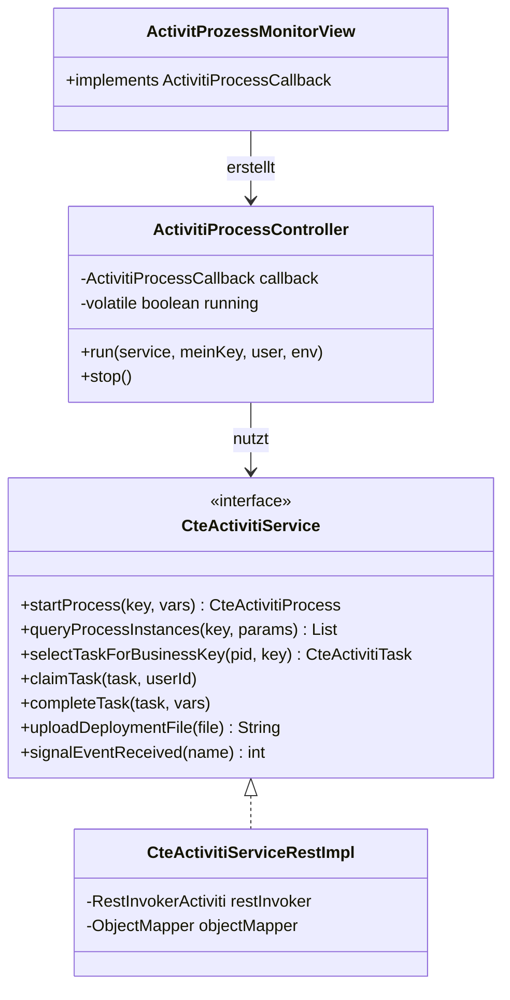

# activiti-process – Tutorial

> **Zielgruppe:** Erfahrene Entwickler ohne Activiti-Vorkenntnisse  
> **Projekt:** [activiti-process auf GitHub](https://github.com/CavdarKemal/activiti-process)

---

## Inhaltsverzeichnis

1. [Was ist Activiti?](#1-was-ist-activiti)
2. [Was macht dieses Projekt?](#2-was-macht-dieses-projekt)
3. [Grundkonzepte](#3-grundkonzepte)
4. [Projektarchitektur im Überblick](#4-projektarchitektur-im-überblick)
5. [Voraussetzungen und Setup](#5-voraussetzungen-und-setup)
6. [Activiti starten](#6-activiti-starten)
7. [Die REST API](#7-die-rest-api)
8. [BPMN-Prozess deployen und starten](#8-bpmn-prozess-deployen-und-starten)
9. [Tasks abarbeiten](#9-tasks-abarbeiten)
10. [Variablen](#10-variablen)
11. [Signals](#11-signals)
12. [Die Java-API: CteActivitiService](#12-die-java-api-cteactivitiservice)
13. [Umgebungskonfiguration](#13-umgebungskonfiguration)
14. [Die Swing-GUI](#14-die-swing-gui)
15. [Activiti 5 vs. Activiti 6](#15-activiti-5-vs-activiti-6)
16. [Tests](#16-tests)
17. [Nächste Schritte](#17-nächste-schritte)

---

## 1. Was ist Activiti?

**Activiti** ist eine leichtgewichtige, in Java geschriebene **Business Process Engine** (BPE).
Sie führt Geschäftsprozesse aus, die in **BPMN 2.0** (Business Process Model and Notation) beschrieben sind.

### Kernidee

Ein Geschäftsprozess besteht aus einer Folge von Schritten — z.B. „Antrag prüfen", „Genehmigung einholen", „Ergebnis versenden". In BPMN werden diese Schritte als Flussdiagramm modelliert. Activiti übernimmt die **Ausführung** dieses Diagramms: Es verwaltet, welche Instanzen gerade laufen, welcher Schritt als nächstes dran ist, und welche Variablen den Prozess begleiten.

### User Tasks — die zentrale Schnittstelle

Im Kontext dieses Projekts ist der wichtigste BPMN-Knotentyp der **User Task**: ein Schritt, der auf einen menschlichen (oder automatisierten) Akteur wartet.

Der typische Ablauf für jeden User Task:

```
1. Prozess-Engine erzeugt den Task und wartet.
2. Ein Client fragt die offenen Tasks ab (Query).
3. Der Client „claimed" den Task (weist ihn einem User zu).
4. Der Client führt die Arbeit durch.
5. Der Client schließt den Task ab (Complete).
6. Die Engine geht zum nächsten Schritt weiter.
```

### Activiti als REST-Service

Activiti läuft als **Web-Applikation** auf Tomcat und stellt eine vollständige **REST API** bereit. Jede Operation — Deployen, Starten, Querien, Claimen, Abschließen — ist über einen HTTP-Endpunkt erreichbar. Das macht Activiti sprachunabhängig nutzbar.

---

## 2. Was macht dieses Projekt?

`activiti-process` ist eine **Java-Bibliothek und GUI-Anwendung**, die die Activiti-REST-API kapselt:

| Schicht | Was sie tut |
|---------|-------------|
| **Service-API** (`CteActivitiService`) | Typesicheres Java-Interface für alle Activiti-Operationen |
| **REST-Implementierung** (`CteActivitiServiceRestImpl`) | Übersetzt Java-Aufrufe in HTTP-Requests; kompatibel mit A5 und A6 |
| **Domain-Objekte** (`CteActivitiProcess`, `CteActivitiTask`, …) | Leichte Wrapper um die JSON-Antworten von Activiti |
| **Umgebungsverwaltung** (`ActivitiEnvironmentManager`) | Lädt `*-activiti.properties`-Dateien für mehrere Activiti-Instanzen |
| **Swing-GUI** (`ActivitProcessTesterMainFrame`) | MDI-Anwendung zur manuellen Prozesssteuerung und Überwachung |

**Hauptanwendungsfall:** Automatisiertes Durchlaufen eines BPMN-Prozesses mit 40+ User Tasks — alle Tasks werden vollautomatisch geclaimt und abgeschlossen.

---

## 3. Grundkonzepte

### 3.1 Deployment

Bevor ein Prozess gestartet werden kann, muss seine BPMN-Definition bei Activiti **deployt** werden. Ein Deployment ist eine versionierte Ablage einer oder mehrerer BPMN-Dateien.

```
Deployment
  └─ Name: "MyProcess Deployment"
  └─ ID:   "1001"
  └─ enthält: MyProcess.bpmn, MySubProcess.bpmn
```

### 3.2 Prozess-Definition

Das Ergebnis eines Deployments ist eine **Prozess-Definition** — die abstrakte Beschreibung des Prozesses. Sie hat einen **Key** (frei wählbar, im BPMN festgelegt) und eine **Version** (wird bei jedem neuen Deployment hochgezählt).

```
Prozess-Definition
  └─ Key:     "MyProcess"
  └─ Version: 1
  └─ ID:      "MyProcess:1:1002"
```

### 3.3 Prozess-Instanz

Jedes Mal wenn ein Prozess **gestartet** wird, entsteht eine neue **Prozess-Instanz** mit einer eindeutigen ID. Viele Instanzen derselben Definition können gleichzeitig laufen.

```
Prozess-Instanz
  └─ ID:      42
  └─ Key:     "MyProcess"
  └─ Status:  running / ended / suspended
```

### 3.4 Task

Ein **Task** ist ein einzelner Ausführungsschritt innerhalb einer Prozess-Instanz. Im Fall von User Tasks ist er „offen", bis er abgeschlossen wird.

```
Task
  └─ ID:                 101
  └─ Name:               "Genehmigung einholen"
  └─ TaskDefinitionKey:  "approvalTask"
  └─ ProcessInstanceId:  42
  └─ Assignee:           null (ungeclaimt) oder "kermit"
```

### 3.5 Variablen

Variablen sind **Schlüssel-Wert-Paare**, die einen Prozess begleiten. Sie können beim Start mitgegeben, in Tasks gelesen und beim Abschließen eines Tasks gesetzt werden. Es gibt:

- **Prozess-Variablen**: sichtbar im gesamten Prozess
- **Task-lokale Variablen**: nur im aktuellen Task sichtbar

### 3.6 Signal

Ein **Signal** ist ein globales Broadcast-Event. Alle Prozesse, die auf dieses Signal warten (Signal-Catch-Event im BPMN), reagieren darauf gleichzeitig. Typischer Einsatz: sofortiger Abbruch aller laufenden Prozesse einer bestimmten Art.

---

## 4. Projektarchitektur im Überblick

### Schichtenmodell

```
┌─────────────────────────────────────────┐
│           Swing-GUI (MDI)               │
│  ActivitProcessTesterMainFrame          │
│    └─ ActivitProzessMonitorView (n×)    │
├─────────────────────────────────────────┤
│  MVC-Brücke: ActivitiProcessCallback   │
│  ActivitiProcessController              │
├─────────────────────────────────────────┤
│  Service-API: CteActivitiService        │
│  CteActivitiServiceRestImpl             │
│  RestInvokerActiviti (HTTP-Client)      │
├─────────────────────────────────────────┤
│  Domain-Objekte                         │
│  CteActivitiProcess, CteActivitiTask,  │
│  CteActivitiDeployment, …              │
├─────────────────────────────────────────┤
│  Konfiguration                          │
│  ActivitiEnvironmentManager             │
│  *-activiti.properties                  │
└─────────────────────────────────────────┘
```

### Klassendiagramm (Überblick)



---

## 5. Voraussetzungen und Setup

### Systemvoraussetzungen

| Software | Version | Zweck |
|----------|---------|-------|
| Docker Desktop | aktuell | Activiti-Container starten |
| JDK 11 | Temurin 11 empfohlen | Java-Bibliothek bauen |
| Git | aktuell | Repository klonen |
| `ci.cmd` / `cit.cmd` | — | Maven-Wrapper (projektspezifisch) |

### Repository klonen

```cmd
cd E:\Projekte\ClaudeCode
git clone https://github.com/CavdarKemal/activiti-process.git
cd activiti-process
```

### Docker-Images bauen (einmalig, ca. 5 Minuten)

```cmd
cd docker\windows

build.cmd       ← Activiti 6.0 Image
build-a5.cmd    ← Activiti 5.19 Image
```

Die Images (`activiti6:latest`, `activiti5:latest`) bleiben lokal gespeichert. Ein Neubauen ist nur nötig, wenn Dateien im `docker/`-Verzeichnis geändert werden.

### Java-Bibliothek bauen

```cmd
ci.cmd 11
```

---

## 6. Activiti starten

### Ports und URLs

| | Activiti 5.19 | Activiti 6.0 |
|---|---|---|
| Port | **9091** | **9090** |
| SMTP-Sink | 2526 | 2525 |
| Process Explorer | http://localhost:9091/process-explorer | http://localhost:9090/process-explorer |
| REST API (Beispiel) | http://localhost:9091/activiti-rest/service/repository/deployments | http://localhost:9090/activiti-rest/service/repository/deployments |
| Web-UI (Activiti App) | – | http://localhost:9090/activiti-app |
| Login (Standard) | `kermit` / `kermit` | `kermit` / `kermit` |

### Container starten

Jeden Befehl in einem **eigenen Terminal-Fenster** starten, damit die Logs sichtbar sind:

```cmd
cd activiti-process\docker\windows

start.cmd       ← Activiti 6 auf Port 9090
start-a5.cmd    ← Activiti 5 auf Port 9091
```

> **Wichtig:** Jeder Start beginnt mit einer **frischen Datenbank** (tmpfs). Deployments, Prozesse und Historien sind nach einem Neustart weg. Das ist gewollt — saubere Ausgangslage für jeden Testlauf.

### Container stoppen

```cmd
stop.cmd        ← Activiti 6
```

Activiti 5: Terminal-Fenster schließen oder `Ctrl+C`.

### Aktiviti ist bereit, wenn …

```
INFO  org.activiti.engine.impl.ProcessEngineImpl  - ProcessEngine default created
```

… in der Tomcat-Ausgabe erscheint (nach ca. 20–30 Sekunden).

---

## 7. Die REST API

Alle Beispiele richten sich gegen **Activiti 5** (Port 9091). Für Activiti 6 einfach `9091` durch `9090` ersetzen. Die API ist identisch.

Authentifizierung: **Basic Auth** mit `kermit:kermit`.

### 7.1 Deployments

```bash
# Alle Deployments auflisten
curl -u kermit:kermit \
  http://localhost:9091/activiti-rest/service/repository/deployments

# BPMN deployen
curl -u kermit:kermit -X POST \
  -F "file=@MeinProzess.bpmn" \
  http://localhost:9091/activiti-rest/service/repository/deployments

# Deployment löschen (cascade=true beendet auch laufende Prozesse)
curl -u kermit:kermit -X DELETE \
  "http://localhost:9091/activiti-rest/service/repository/deployments/1234?cascade=true"
```

### 7.2 Prozess-Definitionen

```bash
# Alle Prozess-Definitionen
curl -u kermit:kermit \
  http://localhost:9091/activiti-rest/service/repository/process-definitions

# Nach Key filtern
curl -u kermit:kermit \
  "http://localhost:9091/activiti-rest/service/repository/process-definitions?key=MeinProzess"
```

### 7.3 Prozess starten

```bash
curl -u kermit:kermit -X POST \
  -H "Content-Type: application/json" \
  -d '{
    "processDefinitionKey": "MeinProzess",
    "variables": [
      {"name": "AUFTRAGS_NR", "value": "AUF-001"},
      {"name": "TYP",         "value": "VOLLSTAENDIG"}
    ]
  }' \
  http://localhost:9091/activiti-rest/service/runtime/process-instances
```

Antwort (Ausschnitt):
```json
{
  "id": "42",
  "processDefinitionKey": "MeinProzess",
  "ended": false,
  "suspended": false
}
```

### 7.4 Laufende Prozesse abfragen

```bash
# Alle laufenden Prozesse
curl -u kermit:kermit \
  http://localhost:9091/activiti-rest/service/runtime/process-instances

# Prozess-Variablen eines Prozesses lesen
curl -u kermit:kermit \
  http://localhost:9091/activiti-rest/service/runtime/process-instances/42/variables

# Einzelne Instanz abrufen
curl -u kermit:kermit \
  http://localhost:9091/activiti-rest/service/runtime/process-instances/42

# Prozess beenden
curl -u kermit:kermit -X DELETE \
  http://localhost:9091/activiti-rest/service/runtime/process-instances/42
```

---

## 8. BPMN-Prozess deployen und starten

### Die mitgelieferten BPMN-Dateien

Das Projekt enthält zwei BPMN-Dateien in `src/main/resources/bpmns/`:

| Datei | Key (Template) | Beschreibung |
|-------|----------------|--------------|
| `CteAutomatedTestProcess.bpmn` | `%ENV%-TestAutomationProcess` | Haupt-Testprozess |
| `CteAutomatedTestProcessSUB.bpmn` | `%ENV%TestAutomationProcessRT2SUB` | Sub-Prozess (Phase 1 & 2) |

Das `%ENV%`-Platzhalter wird zur Laufzeit durch den Umgebungs-Präfix ersetzt (z.B. `ENE`, `GEE`). So können mehrere Umgebungen parallel laufen, ohne sich gegenseitig zu beeinflussen.

### Deployment über die Java-API

```java
// Service erstellen
CteActivitiService service = new CteActivitiServiceRestImpl(config);

// Altes Deployment löschen (falls vorhanden)
service.deleteDeploymentForName("ENE-TestAutomationProcess Deployment");

// BPMN für Umgebung vorbereiten (%ENV% ersetzen)
File mainBpmn = service.prepareBpmnFileForEnvironment(
    "CteAutomatedTestProcess.bpmn", "ENE"
);
File subBpmn = service.prepareBpmnFileForEnvironment(
    "CteAutomatedTestProcessSUB.bpmn", "ENE"
);

// Deployen
service.uploadDeploymentFile(mainBpmn);
service.uploadDeploymentFile(subBpmn);
```

### Prozess starten

```java
Map<String, Object> params = new HashMap<>();
params.put("MEIN_KEY",  "ENE");
params.put("TEST_TYPE", "PHASE1_AND_PHASE2");

CteActivitiProcess process = service.startProcess(
    "ENE-TestAutomationProcess",
    params
);

System.out.println("Gestartet mit ID: " + process.getId());
```

---

## 9. Tasks abarbeiten

### Tasks abfragen

```bash
# Alle offenen Tasks
curl -u kermit:kermit \
  http://localhost:9091/activiti-rest/service/runtime/tasks

# Tasks einer bestimmten Prozessinstanz
curl -u kermit:kermit \
  "http://localhost:9091/activiti-rest/service/runtime/tasks?processInstanceId=42"

# Tasks mit Prozess-Variablen abfragen (POST Query)
curl -u kermit:kermit -X POST \
  -H "Content-Type: application/json" \
  -d '{
    "includeProcessVariables":    true,
    "includeTaskLocalVariables":  true,
    "processInstanceVariables": [
      {"name": "AUFTRAGS_NR", "value": "AUF-001", "operation": "equals", "type": "string"}
    ]
  }' \
  http://localhost:9091/activiti-rest/service/query/tasks
```

### Task claimen

```bash
curl -u kermit:kermit -X POST \
  -H "Content-Type: application/json" \
  -d '{"action": "claim", "assignee": "kermit"}' \
  http://localhost:9091/activiti-rest/service/runtime/tasks/101
```

### Task abschließen

```bash
curl -u kermit:kermit -X POST \
  -H "Content-Type: application/json" \
  -d '{
    "action": "complete",
    "variables": [
      {"name": "WARTEZEIT", "value": "PT1S"}
    ]
  }' \
  http://localhost:9091/activiti-rest/service/runtime/tasks/101
```

### Vollständiger Task-Zyklus in Java

```java
// Task für eine Prozessinstanz finden
CteActivitiTask task = service.selectTaskForBusinessKey(
    process.getId(), "ENE"
);

System.out.println("Task: " + task.getName()
    + " (Key: " + task.getTaskDefinitionKey() + ")");

// Claimen
service.claimTask(task, "kermit");

// Abschließen (optionale Variablen mitgeben)
Map<String, Object> taskVars = new HashMap<>();
taskVars.put("ERGEBNIS", "OK");
service.completeTask(task, taskVars);
```

### Automatisierter Task-Loop

```java
boolean running = true;

while (running) {
    // Ist der Prozess bereits beendet?
    CteActivitiProcess state = service.getProcessInstanceByID(process.getId());
    if (state.isEnded()) {
        System.out.println("Prozess beendet.");
        break;
    }

    // Nächsten Task holen
    CteActivitiTask task = service.selectTaskForBusinessKey(
        process.getId(), "ENE"
    );

    System.out.println("Bearbeite: " + task.getName());

    service.claimTask(task, "kermit");
    service.completeTask(task, Collections.emptyMap());
}
```

---

## 10. Variablen

### Variablen beim Prozessstart

```java
Map<String, Object> startVars = new HashMap<>();
startVars.put("MEIN_KEY",  "ENE");
startVars.put("TEST_TYPE", "PHASE1_AND_PHASE2");
startVars.put("TIMEOUT",   "PT30S");

service.startProcess("ENE-TestAutomationProcess", startVars);
```

### Variablen beim Task-Abschluss

```java
Map<String, Object> taskVars = new HashMap<>();
taskVars.put("TIME_BEFORE_NEXT_TASK", "PT1S");
taskVars.put("PHASE_ERGEBNIS",        "ERFOLGREICH");

service.completeTask(task, taskVars);
```

### Variablen aus einem Task lesen

```java
CteActivitiTask task = service.selectTaskForBusinessKey(processId, "ENE");
Map<String, String> vars = task.getVariables();

String meinKey = vars.get("MEIN_KEY");
String testType = vars.get("TEST_TYPE");
```

### Variablen per REST lesen

```bash
# Prozess-Variablen
curl -u kermit:kermit \
  http://localhost:9091/activiti-rest/service/runtime/process-instances/42/variables

# Task-lokale Variablen
curl -u kermit:kermit \
  http://localhost:9091/activiti-rest/service/runtime/tasks/101/variables
```

### Historische Variablen

```bash
curl -u kermit:kermit \
  "http://localhost:9091/activiti-rest/service/history/historic-variable-instances?processInstanceId=42"
```

---

## 11. Signals

Ein Signal ermöglicht es, **mehrere laufende Prozesse gleichzeitig zu beeinflussen** — ohne die einzelnen Prozess-IDs zu kennen.

### Anwendungsfall: Prozesse global abbrechen

Das BPMN enthält ein **Signal Catch Event** mit dem Namen `ENE-cancelProcessSignal`. Sobald das Signal gesendet wird, reagieren alle Prozesse, die gerade auf dieses Signal warten.

```bash
# Signal senden
curl -u kermit:kermit -X POST \
  -H "Content-Type: application/json" \
  -d '{"signalName": "ENE-cancelProcessSignal"}' \
  http://localhost:9091/activiti-rest/service/runtime/signals
```

```java
// Signal per Java-API senden
int betroffeneProzesse = service.signalEventReceived("ENE-cancelProcessSignal");
System.out.println("Signal an " + betroffeneProzesse + " Prozesse gesendet.");
```

> **Hinweis:** Der Signalname enthält den Umgebungs-Präfix (`ENE-`). Das stellt sicher, dass nur Prozesse der ENE-Umgebung reagieren — Prozesse anderer Umgebungen bleiben unberührt.

---

## 12. Die Java-API: CteActivitiService

### Das Interface

`CteActivitiService` ist der zentrale Einstiegspunkt für alle Activiti-Operationen:

```java
public interface CteActivitiService {

    // Prozesse
    CteActivitiProcess startProcess(String key, Map<String, Object> vars) throws Exception;
    List<CteActivitiProcess> queryProcessInstances(String key, Map<String, Object> params) throws Exception;
    CteActivitiProcess getProcessInstanceByID(Integer id) throws Exception;
    void deleteProcessInstance(Integer id) throws Exception;
    InputStream getProcessImage(Integer processInstanceId) throws Exception;

    // Tasks
    List<CteActivitiTask> listTasks(Map<String, Object> params) throws Exception;
    CteActivitiTask selectTaskForBusinessKey(Integer processId, String key) throws Exception;
    void claimTask(CteActivitiTask task, String userId) throws Exception;
    void unclaimTask(CteActivitiTask task) throws Exception;
    void completeTask(CteActivitiTask task, Map<String, Object> vars) throws Exception;

    // Deployments
    String uploadDeploymentFile(File file) throws Exception;
    CteActivitiDeployment getDeploymentForName(String name) throws Exception;
    void deleteDeploymentForName(String name) throws Exception;

    // Signals
    int signalEventReceived(String signalName) throws Exception;
}
```

### Service erstellen

```java
// Konfiguration aus einer Umgebung laden
ActivitiEnvironment env = ActivitiEnvironmentManager.load("ene");

RestInvokerConfig config = new RestInvokerConfig(
    env.getUrl() + "/activiti-rest/service",
    env.getUser(),
    env.getPassword()
);

CteActivitiService service = new CteActivitiServiceRestImpl(config);
```

### Domain-Objekte

| Interface | Wichtige Methoden |
|-----------|------------------|
| `CteActivitiProcess` | `getId()`, `isEnded()`, `isSuspended()` |
| `CteActivitiTask` | `getId()`, `getName()`, `getTaskDefinitionKey()`, `getProcessInstanceId()`, `getVariables()` |
| `CteActivitiDeployment` | `getId()`, `getName()` |

---

## 13. Umgebungskonfiguration

### Properties-Dateien

Das Projekt unterstützt mehrere Activiti-Instanzen über `*-activiti.properties`-Dateien im Projektstamm.

```
ene-activiti.properties
gee-activiti.properties
abe-activiti.properties
```

Aufbau am Beispiel `ene-activiti.properties`:

```properties
activiti.url=http://localhost:9091;;http://localhost:9090
activiti.user=CAVDARK-ENE
activiti.password=cavdark
```

| Eigenschaft | Bedeutung |
|-------------|-----------|
| `activiti.url` | Primäre URL und Fallback-URLs, getrennt durch `;;` |
| `activiti.user` | Login-Benutzer für diese Umgebung |
| `activiti.password` | Passwort |
| **ENV-Name** | Wird aus dem Dateinamen-Präfix abgeleitet (`ene` → `ENE`) |
| **MEIN_KEY** | Business Key, identisch mit dem ENV-Namen |

### Umgebung laden

```java
// Alle verfügbaren Umgebungen anzeigen
List<String> names = ActivitiEnvironmentManager.findEnvironmentNames();
// → ["ENE", "GEE", "ABE"]

// Eine bestimmte Umgebung laden
ActivitiEnvironment env = ActivitiEnvironmentManager.load("ene");
System.out.println(env.getName());     // ENE
System.out.println(env.getUrl());      // http://localhost:9091 (Primär-URL)
System.out.println(env.getMeinKey());  // ENE
```

### Umgebung zur Laufzeit wechseln

Der `ActivitiEnvironmentManager` lädt die Properties aus dem Arbeitsverzeichnis. Neue Umgebungen werden durch Anlegen einer weiteren `xyz-activiti.properties`-Datei hinzugefügt — ohne Code-Änderung.

---

## 14. Die Swing-GUI

### Start der Anwendung

```cmd
ci.cmd 11                   ← Bauen
java -jar target/activiti-process-2.0.0-SNAPSHOT.jar
```

Alternativ direkt über die IDE: `ActivitProcessTesterMainFrame.main()`.

### Hauptfenster: MDI-Container

Das Hauptfenster ist ein **Multiple Document Interface (MDI)**. Über die Toolbar können beliebig viele **Monitor-Fenster** geöffnet werden — eines pro Activiti-Instanz oder Umgebung.

```
┌─────────────────────────────────────────────────────────┐
│  Toolbar: [+ Monitor] [Tiles ⬜] [Cascade ⋮]            │
├──────────────────┬──────────────────────────────────────┤
│  Monitor ENE     │  Monitor GEE                         │
│  [Env: ENE    ▼] │  [Env: GEE    ▼]                    │
│  [Host: local ▼] │  [Host: local ▼]                    │
│  [Start] [Stop]  │  [Start] [Stop]                      │
│                  │                                       │
│  [Prozessdiagramm]│  [Prozessdiagramm]                  │
│                  │                                       │
│  ────────────────│  ─────────────────                   │
│  Log:            │  Log:                                 │
│  [10:15] Task 1  │  [10:16] Task 1                      │
│  [10:15] Task 2  │  ...                                  │
│  ...             │                                       │
└──────────────────┴──────────────────────────────────────┘
```

### Monitor-Fenster

Jedes Monitor-Fenster steuert eine eigene Prozess-Ausführung:

| Steuerelement | Funktion |
|---------------|----------|
| **Env-Dropdown** | Umgebung wählen (`ENE`, `GEE`, `ABE`) — aus Properties geladen |
| **Host-Dropdown** | Aktiviti-URL wählen (Primär oder Fallback) |
| **Start** | Prozess deployen, starten und automatisch alle Tasks durchlaufen |
| **Stop** | Laufenden Prozess nach dem aktuellen Task sauber unterbrechen |
| **Prozessdiagramm** | Aktualisiert sich nach jedem Task — zeigt die aktuelle Position im BPMN |
| **Log-Bereich** | Zeitgestempelte Ausgabe jedes Schritts |
| **Statusleiste** | Aktuell bearbeiteter Task |

### Was passiert beim Klick auf „Start"?

1. GUI prüft, ob bereits Prozessinstanzen laufen.
2. Falls ja: Dialog mit drei Optionen:
   - **Neu starten** (löscht alte Instanzen)
   - **Fortsetzen** (setzt den laufenden Prozess fort)
   - **Abbrechen**
3. BPMNs werden deployt (alte Deployments werden zuerst entfernt).
4. Prozess wird gestartet.
5. Task-Loop beginnt: Query → Claim → Complete → wiederholen, bis der Prozess endet.
6. Nach jedem Task: Prozessdiagramm wird aktualisiert.

### MVC-Muster und Thread-Sicherheit

Die GUI ist nach einem **Callback-Muster** aufgebaut:

```
ActivitProzessMonitorView  implements  ActivitiProcessCallback
         │
         │  übergibt "this" an:
         ▼
ActivitiProcessController  (läuft im Worker-Thread)
         │
         │  ruft auf:
         ▼
ActivitiProcessCallback.onLog()
ActivitiProcessCallback.onStatus()
ActivitiProcessCallback.onProcessImageUpdate()
ActivitiProcessCallback.onExistingProcessFound()
```

**Warum das wichtig ist:** Swing erlaubt GUI-Zugriffe nur vom **Event Dispatch Thread (EDT)**. Der Controller läuft im Worker-Thread, damit die GUI nicht einfriert. Alle Rückmeldungen an die View werden daher über `SwingUtilities.invokeLater()` (asynchron) oder `SwingUtilities.invokeAndWait()` (blockierend, wenn eine Nutzerantwort benötigt wird) auf den EDT umgeleitet.

Für eine detaillierte Erklärung mit Sequenzdiagramm: [`docs/controller-callback-pattern.md`](docs/controller-callback-pattern.md).

---

## 15. Activiti 5 vs. Activiti 6

Das Projekt unterstützt beide Versionen. Die Unterschiede sind in `CteActivitiServiceRestImpl` transparent gekapselt.

### `activiti:inheritVariables`

| | Activiti 5.19 | Activiti 6.0 |
|---|---|---|
| `activiti:inheritVariables="true"` | **Wird ignoriert** (erst ab 5.22 unterstützt) | Funktioniert |

In den BPMN-Dateien werden Prozess-Variablen daher explizit per `<activiti:in>` weitergegeben:

```xml
<callActivity activiti:inheritVariables="true">
  <extensionElements>
    <!-- Explizit für A5.19-Kompatibilität: -->
    <activiti:in sourceExpression="${'PHASE_1'}" target="TEST_PHASE"/>
    <activiti:in source="MEIN_KEY" target="MEIN_KEY"/>
  </extensionElements>
</callActivity>
```

### Task-Query: Variablen-Merging

Bei einem Task-Query mit `includeProcessVariables=true`:

| | Activiti 5.19 | Activiti 6.0 |
|---|---|---|
| Prozess-Variablen | Feld `processVariables` | Feld `variables` (zusammen mit Task-Variablen) |

`CteActivitiServiceRestImpl` merged beide Felder automatisch, sodass `task.getVariables()` in beiden Versionen gleich funktioniert.

### BPMN-Sync-Regel

> Die BPMNs in `src/main/resources/bpmns/` und `src/test/resources/bpmns/` müssen **identisch** sein. Änderungen immer in **beiden** Verzeichnissen vornehmen.

---

## 16. Tests

### Testklassen im Überblick

| Testklasse | Voraussetzung | Beschreibung |
|------------|---------------|--------------|
| `CteActivitiRestInvokerMockTest` | keiner (WireMock) | REST-Invoker mit gemocktem HTTP-Server |
| `CteActivitiRestInvokerIntegrationTest` | Docker | GET, POST, PUT, DELETE gegen echte Activiti-Instanz |
| `CteActivitiRestServiceIntegration1Test` | Docker | Deployments, Prozess-Definitionen |
| `CteActivitiRestServiceIntegration2Test` | Docker | Prozess starten, Task-Abfragen, Variablen |
| `CteActivitiRestServiceIntegration3Test` | Docker | Claim/Unclaim, Signals |
| `CteActivitiRestServiceIntegration4Test` | Docker | Automatisierter Prozess mit Sub-Prozess |
| `CteActivitiRestServiceIntegrationTest` | Docker | Parallele Prozesse mit Signals |
| `CteActivitiUtilsTest` | Docker | Upload-Utilities |
| `CteAutomatedProcessIntegrationTest` | Docker | Vollständiger `CteAutomatedTestProcess` (44 Tasks) |

### Unit-Tests ausführen (kein Docker nötig)

```cmd
ci.cmd 11
```

Das Standard-Profil schließt `*IntegrationTest*.java` aus.

### Integrationstests ausführen (Docker erforderlich)

```cmd
REM Zuerst Activiti starten:
cd docker\windows && start.cmd

REM Dann Tests:
cit.cmd 11
```

Das `-Pitest`-Profil in `cit.cmd` aktiviert alle Integrationstests.

### Activiti-Version für Tests umschalten

In `src/test/resources/activiti-test.local-cfg.xml`:

```xml
<!-- Activiti 6 (Port 9090) -->
<property name="serviceURL" value="http://localhost:9090/activiti-rest/service"/>

<!-- Activiti 5 (Port 9091) -->
<property name="serviceURL" value="http://localhost:9091/activiti-rest/service"/>
```

### Historische Daten nach einem Testlauf

```bash
# Abgeschlossene Prozesse
curl -u kermit:kermit \
  "http://localhost:9091/activiti-rest/service/history/historic-process-instances?size=50&order=desc&sort=processInstanceId"

# Alle Aktivitäten einer Prozessinstanz (Audit Trail)
curl -u kermit:kermit \
  "http://localhost:9091/activiti-rest/service/history/historic-activity-instances?processInstanceId=42&sort=startTime&order=asc"
```

---

## 17. Nächste Schritte

### Process Explorer

Der mitgelieferte **Process Explorer** zeigt alle Prozesse und Deployments im Browser — praktisch für manuelle Inspektion:

- http://localhost:9090/process-explorer (Activiti 6)
- http://localhost:9091/process-explorer (Activiti 5)

### Activiti App (nur A6)

Die **Activiti App** unter http://localhost:9090/activiti-app bietet einen grafischen BPMN-Designer und einen Task-Manager im Browser.

Login: `kermit` / `kermit`

### Eigene BPMN-Prozesse einbinden

1. BPMN-Datei in `src/main/resources/bpmns/` ablegen
2. Prozess-Key im BPMN auf das `%ENV%`-Schema anpassen (optional)
3. `CteActivitiUtils.prepareBpmnFileForEnvironment()` nutzen, um den Platzhalter zu ersetzen
4. Über `service.uploadDeploymentFile()` deployen

### Weiterführende Dokumentation im Projekt

| Dokument | Inhalt |
|----------|--------|
| [`SETUP.md`](SETUP.md) | Vollständige Setup- und Betriebsanleitung |
| [`docs/controller-callback-pattern.md`](docs/controller-callback-pattern.md) | MVC-Muster und Thread-Sicherheit in der GUI |
| [`docs/diagrams.md`](docs/diagrams.md) | Klassen- und Sequenzdiagramme (Mermaid) |
| [`docker/README.md`](docker/README.md) | Docker-spezifische Details |

---

*Erstellt: April 2026*
